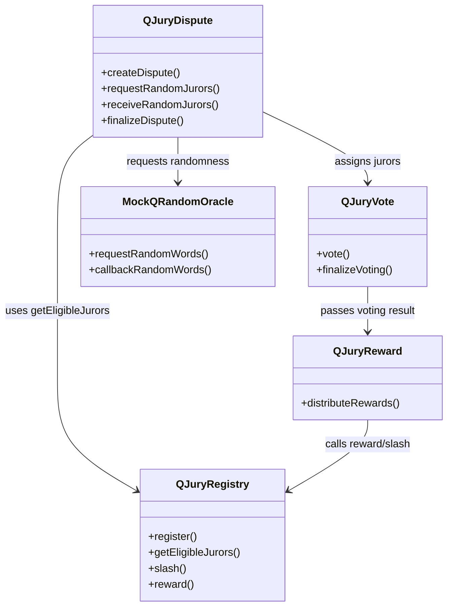

```mermaid
classDiagram
    class QJuryRegistry {
        +register()
        +getEligibleJurors()
        +slash()
        +reward()
    }

    class QJuryDispute {
        +createDispute()
        +requestRandomJurors()
        +receiveRandomJurors()
        +finalizeDispute()
    }

    class QJuryVote {
        +vote()
        +finalizeVoting()
    }

    class QJuryReward {
        +distributeRewards()
    }

    class MockQRandomOracle {
        +requestRandomWords()
        +callbackRandomWords()
    }

    QJuryDispute --> QJuryRegistry : uses getEligibleJurors
    QJuryDispute --> MockQRandomOracle : requests randomness
    QJuryDispute --> QJuryVote : assigns jurors
    QJuryVote --> QJuryReward : passes voting result
    QJuryReward --> QJuryRegistry : calls reward/slash

```

